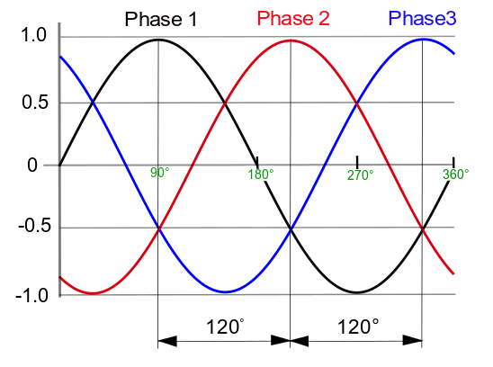
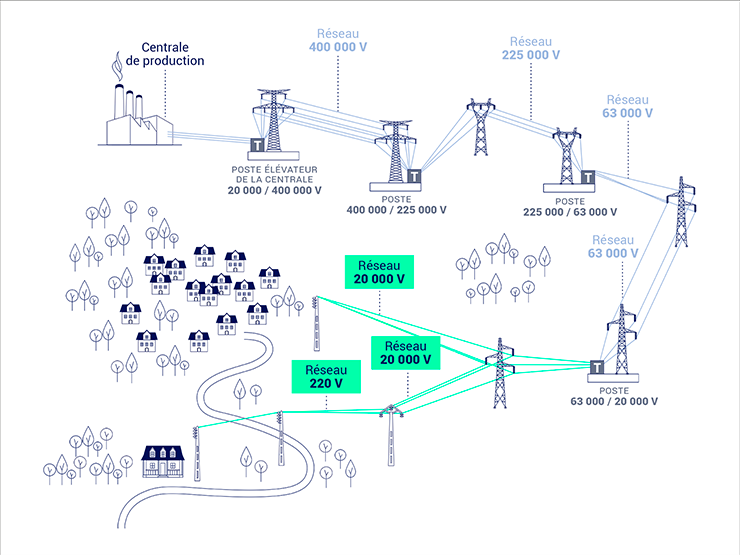
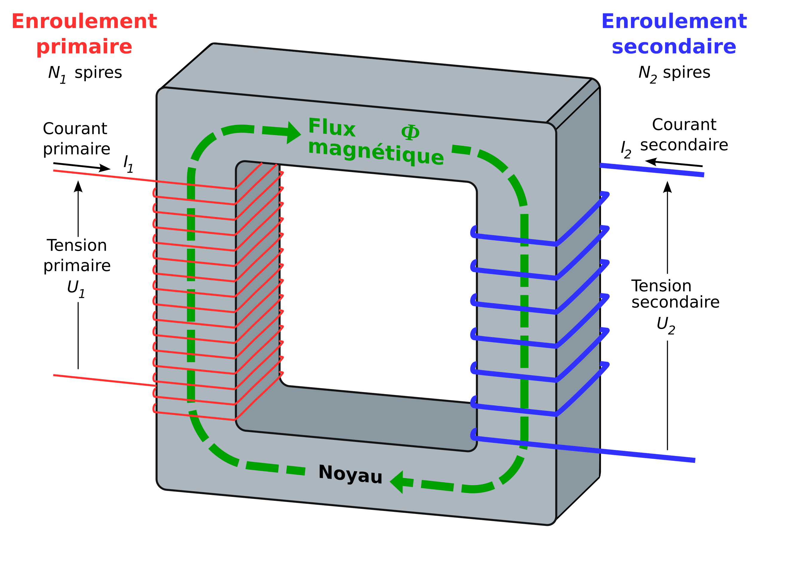
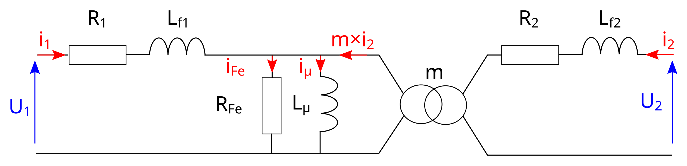
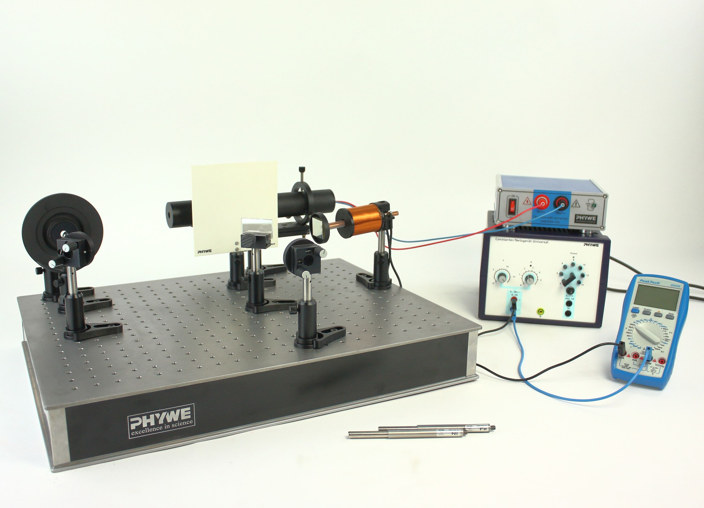

# TIPE  
---
Suivi des recherches

#### 31/01/2025
 - Outils à utiliser :
 - <a href="https://scholar.google.fr/schhp?hl=fr&as_sdt=0,5">Google Scholar</a>
  - Recherches du jour :
      - [Réduction de bruit active sur GoogleScholar](https://scholar.google.fr/scholar?hl=fr&as_sdt=0%2C5&q=r%C3%A9duction+de+bruit+active&btnG=&oq=r%C3%A9duction+de+bruit+)
  - Idées de sujet du jour :
    - _**Réduction de bruit active**_ :
      1. Comment ca marche? Active, passive ?
      2. Comment inverser la phase d'un signal : analogique numérique ?
      3. Si la réduction de bruit active produit un "anti-son", produit-il une fatigue auditive ? car même si - par - = +, la réduction par production de bruit peut peut être endommager l'oreille aussi.
      4. Qu'en est-il du mode "Transparence" ?
      5. Quelle différence entre les casques et les écouteurs ?
      6. Faire un système DIY
    - Micros Neumann KU100 pour étudier les différents casques.

-
#### 2/02/2025
Recherches du jour :

- Réduction de bruit active brevetée par Bose en 1996 au départ pour le domaine de l'aviation exclusivement.

- La qualité de la réduction de bruit dépend du nombre de micros, de leur qualité, de la vitesse de la carte, le nombre d'écoute de l'environement extérieur (700/secondes). La qualité est bonne à partir de 4 micros par casque.

- La réduction fonctionne d'autant mieux que les bruit à atténuer sont simples. Le grondement d'un moteur dans un avion, voiture, train sont simples à atténuer face à des discussions ou à des bruits de clavier qui sont plus imprévisibles.

-
#### 7/02/2025
Recherches du jour :

Vibiscus :  

- [Article sur Techniques de l'ingénieur.](./Articles\ TI/Vibiscus - la fine fleur de la réduction de bruit | Techniques de l'Ingénieur.pdf)
- Startup qui concoit des matériaux réduisant le son de manière active. Analogie avec les pixels d'un écran : Chaque partie du matériaux peut être modifié pour attenuer un son. Alternative à la réduction de bruit active par création de son en opposition de phase.

Orosound start'up Francaise production de casques à réduction de bruit active très efficace. STAGE ? A CONTATCTER !

-
#### 14/02/2025

Lien avec L'aBRI UBordeaux. Peut être utile pour mener des expérimentations sur le son, son acquisition et son traitement numérique.    

Liens donnés par Mr Raimi pour les recherches
- Technique de l'ingénieur
- sci hub
- universalis
- google scholar
- hal.archives-ouvertes
- sudoc abes
- https://hal.science
- https://bupdoc.udppc.asso.fr/
- https://culturesciencesphysique.ens-lyon.fr/
- https://eduscol.education.fr/sti/si-ens-paris-saclay
- https://pixees.fr/
- https://www.olymphys.fr/public/index.php

Dans notre salle de classe, le néon faisait un bruit dérangeant. Je l'ai analysé : fréquence de 50 Hz. Plus tard en TP de Chimie, le bloc d'alimentation d'un agitateur magnétique produisait un son aigü vers un multiple de 50 Hz. Fort de ces deux expériences, je me suis dit qu'il devait exister un lien entre ces bruits et la fréquence d'oscillation du courant.

 - [Vulgarisation bruit des Néons, Brut](https://www.brut.media/fr/videos/culture-lifestyle/musique/le-scintillement-et-le-bourdonnement-du-neon)

 - Recherches sur le dB et le dBA...
 - [Recherches Sur Hal `Réduction de bruit`](https://hal.science/search/index?q=r%C3%A9duction+de+bruit+active)
 - [Recherches sur TI `réduction de bruit active`](https://www-techniques-ingenieur-fr.docelec.u-bordeaux.fr/search.html?types=822005e&sc=3f&dm=7fff&limit=10&query=r%C3%A9duction+de+bruit+active&page=1)

-
#### 21/02/2025  

Idées et infos de la semaine:  
1. Néons  
- Gaz  
  
-
#### 14/03/2025
Recherches sur les vibrations induites par les transformateurs electriques.
A maitriser avant de se pencher sur le sujet :  

- [x] Distribution du réseau électrique
- [x] Comment marche un transformateur
- [ ] principe interne et fonctionnement 
- [ ] Equations de fonctionnement
- [ ] dégager un modèle simple

Vidéo pour comprendre :

- transformateurs sont au coeur de notre vie
- dispositif pour transferer l'énergie electrique
- seuelement en courant alternatfi et pas en continu
- Là où les appareils traditionnels ont comme mesure l'ampère et le volt, on utilise le voltampère
- deux bobines séparés par un noyeau de fer
	- pas le même nombre de spires des deux côtés
	- champs magnétiques des bobines transporté par le fer doux
- transformateur élévateur / abaisseur
-  à cause de la resistance du cable : petite tension => bcp de pertes, grande tension moins

- transformateur est un convertisseur statique permettant de transformer une tension sinusoiïdale en unte autre tension sinusoïdale

-
#### 15 et 16/03/2025
Visionnage de différentes vidéos pour commencer à comprendre.
Les transformateurs jouent un rôle important dans notre quotidient puisqu'ils permettent de réhausser et d'abaisser la tension du courant pour arriver jusque dans nos maisons.

#####Notion de courant triphasé :
Pour des soucis de performances (puissance et moindres pertes) le courant triphasé est préférable au monophasé.
Le courant triphasé possède trois phases décalées de 120° et d'un neutre (d'où 4 fils lors du transport) contre une phase et un neutre pour le monophasé. Les trois phases ont la même fréquence ($f = 50\text{ Hz}$ en France).  

*fig. 1 : Allure des courbes du courant triphasé*

Le courant triphasé alimente des machines ayant besoin de plus de puissance. Moteurs asynchornes.
Montages en étoile Y ou en triangle Δ.

#####Chemin de l'électricité en général :
1. Énérgie prduite dans une centrale (nucléaire en France) délivre du courant triphasé à 12 kV
2. Tension haussée par un *transformateur élévateur* à 230 kV pour le transport sur des longues distances dans les cables pour éviter les pertes par effet Joule (Ri^2)
3. Transport
4. Transformateur abaisseur à 69 kV pour distribution au réseau de moyenne distribution
5. Lien avec les industriels qui possèdent leur propres transformateurs abaisseurs. Ils utilisent souvent le triphasé.
6. Transformateur abaisseur à 12.4 kV pour la sous distribution entre les quartiers par exemple
7. Transformateurs abaisseurs pour des chaque rue / quartier à 480/280V en triphasé ou 240/120V en monophasé.

*fig. 2 : Schéma du réseau de distribution électrique*

-
#### 21/03/2025 puis 28/03/2025
##### Electromagnétisme :

On a $dF_s = \displaystyle \int_S \vec{i}dl \land \vec{B}$

On décrit le flux du chmap magnétique à travers une surface $\Sigma$ par : $\displaystyle \Phi = \iint_\Sigma \vec{B} \cdot \vec{n}\quad ds$  

##### Fonctionnement du transformateur :

*fig. 3 : Schéma de principe du transformateur idéal*

Le transformateur fonctionne par conduction de champ magnétiques. Une bobine primaire recoit un courant primaire créant un champ magnétique. Celui-ci est conduit par le noyeau en fer doux à une deuxième bobine qui va recevoir ce champ magnértique et le reconvertir en énergie electrique.
Une spire de bobine correspond à un Volt transformé.

$m = \dfrac{U_2}{U_1} = \dfrac{N_2}{N_1}$
La puissance apparente maximale d'un transformateur est exprimée en VA.  

######Pertes du transformateur  

*fig. 4 Schéma équivalent d'un transformateur réel*
- Pertes par courants de Foucault, l'induction

-
#### 28/03/2025
Mr Raimi m'a trouvé une idée d'expérience. En gros, ca vibre dans le transfo à cause de la **magnétostriction** (et peut être le phénomène d'*hystérésis*). On peut mesurer ça par _interférométrie_ avec le dispositif suivant :  *fig. 4 : Dispositif éxpérimental*

L'idée est de mesurer grâce au prinicpe d'interférométrie de Michelson.

-
#### 02/04/2025
Contact de Johan Boullet, de SupOptique dans le but d'aller réaliser le TP là-bas.

**Recherches sur la magnétostriction:**
- Est une propriété des métaux féromagnétiques qui se déforment sous l'inlfuence d'un champ magnétique
- la déformation est de l'ordre du $10^{-5}$m = $ 10 \mu\,\text{m}$
- La distance est de $5$.
- Les métaux dans les bobines ont tendances à se déformer

-
#### 09/04/2025
Lecture du papier de recherche sur la modélisation par un approche multiphysique du bruit d'un transformateu électrique.
Papier de recherches écrit par J-B.DUPONT de l'entreprise **Vibratec**. Contacté! [Site de Vibratec](https://vibratec.fr/). Vibratec, entreprise de mesure physiques basée à Lyon en acoustique, analyse vibratoire, mesures de déformation...
Principe du modèle :
- méthode de résolution des équations aux dérivées partielles par la méthode des éléments finis.
- modèle thermodynamique pour en déduire une analogie acoustique.
	- modèle par la loi de Hook dont la forme simplifiée est : $\vec{F} = -k\;(l-l_0)\;\vec{u_x}$
	- en posant $\sigma$ la contrainte $\sigma = \dfrac{F}{S} $ avec F la force et S la surface, puis en posant $\varepsilon = \dfrac{\Delta \ell}{\ell_0} = \dfrac{\ell-\ell_0}{\ell_0}$, la loi de Hooke s'exprime : $\sigma = E \; \varepsilon$, avec $E$ le module d'élasticité du matériau (module de Youg).
	- Écriture sous forme de tenseurs : $[\sigma]=[C]\cdot[\varepsilon]$.

- découverte de l'entreprise **SADTEM**. Produit des Transformateurs à Douai (Lille) de basse et moyenne tension. Peut être intéréssant d'aller les rencontrer. [Site de SADTEM](https://www.sadtem.com/fr/entreprise/)

-
#### 10/04/2025
Expérience menée à la maison:
- mesure de différents champs électromagnétiques domestiques avec Phyfox:
	- aimant : $\geqslant 5000 \;\mu T$
	- transformateur chargeur d'ordinateur : faible, de l'ordre du $100 \;\mu T$
	- En portant l'oreille à un transformateur, on peut entendre le bruit de la magnétostriction. Ce phénomène est accru lorsque l'on place un aimant permanent sur la coque extérieur d'un tel transformateur :
		- L'aimant se met dans la direction du champ magnétique de lui-même
		- le bruit est plus important et toute la structure entre en vibration
		- approcher un tel aimant proche d'un transformateur est-il dangeureux ? qu'en est-il de  ses performances avec un champ perturbateur ?

#### 11/04/2025
Discussion avec Mr Raimi. Apparament, je pars trop loin, j'ai encore élargit mes recherches...
Texte normal suivi d’un texte coloré en vert dans un paragraphe.

Téléphone Johan Boullet :
- [x] message laissé...
- [ ] appel ?

# Il faut se reconcentrer sur la **MAGNÉTOSTRICTION**

---
## À contacter
- [ ] Contacter Orosound stage été
- [ ] Contacter collègue de Julie Géan
- [x] Système de TP à l'IUT MP. Possibilité de discuter avec des opticiens.
- [x] Premier contact avec SupOptique pour un TP.
- [ ] Entreprise de transformateurs? ABB? EDF ? Vibratec
